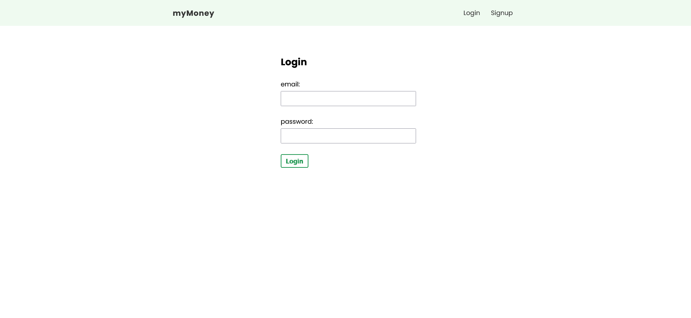
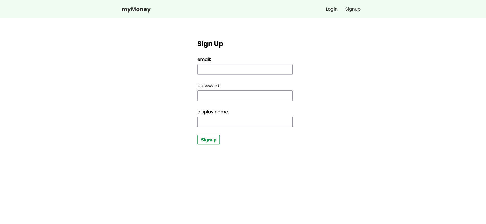
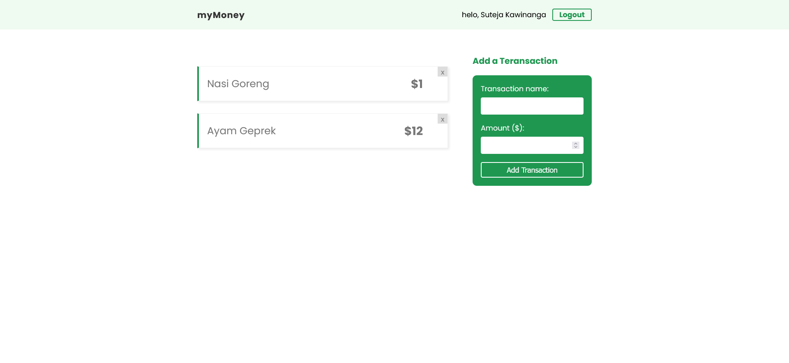

# myMoney

A simple finance tracker app, made with ReactJs and Firebase.

## Some preview

## How to install?

### `git clone https://github.com/sutejakw/myMoney.git`

Clone the repository.

### `yarn install / npm install`

Install dependencies.

### `yarn start / npm run start`

Run project on local server.
